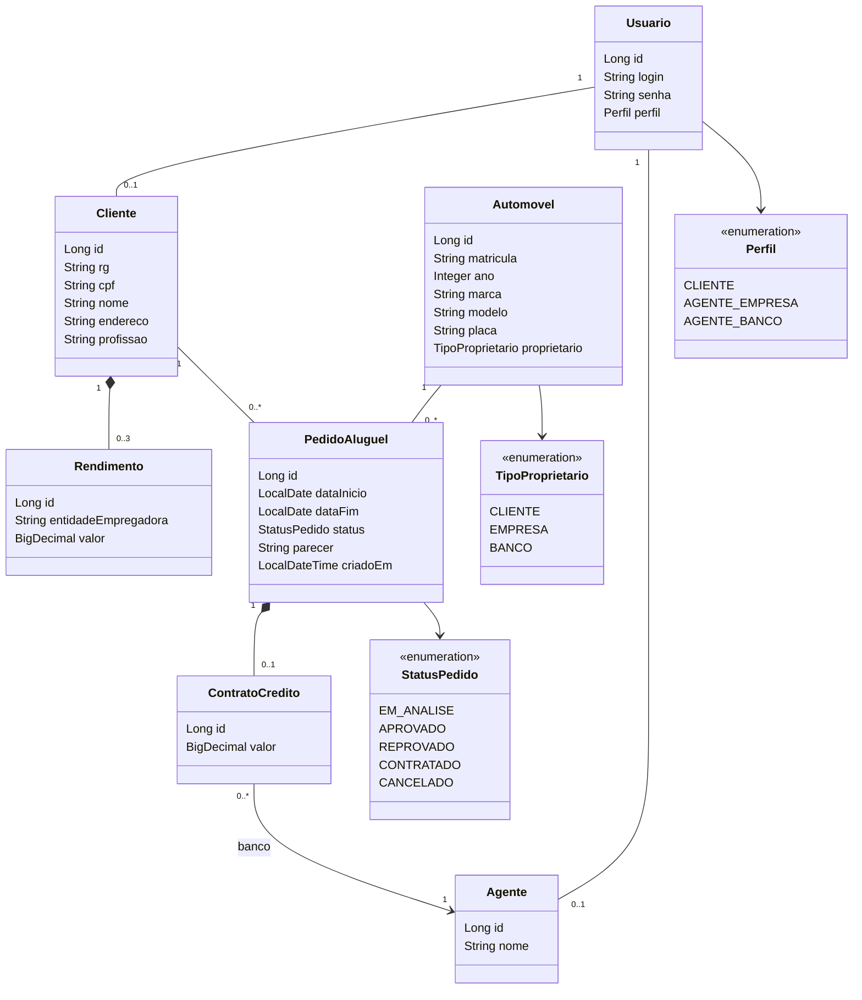

# Diagrama de Classes

```mermaid
classDiagram
    class Usuario {
        Long id
        String login
        String senha
        Perfil perfil
    }
    class Cliente {
        Long id
        String rg
        String cpf
        String nome
        String endereco
        String profissao
    }
    class Rendimento {
        Long id
        String entidadeEmpregadora
        BigDecimal valor
    }
    class Agente {
        Long id
        String nome
    }
    class Automovel {
        Long id
        String matricula
        Integer ano
        String marca
        String modelo
        String placa
        TipoProprietario proprietario
    }
    class PedidoAluguel {
        Long id
        LocalDate dataInicio
        LocalDate dataFim
        StatusPedido status
        String parecer
        LocalDateTime criadoEm
    }
    class ContratoCredito {
        Long id
        BigDecimal valor
    }
    class Perfil {
        <<enumeration>>
        CLIENTE
        AGENTE_EMPRESA
        AGENTE_BANCO
    }
    class StatusPedido {
        <<enumeration>>
        EM_ANALISE
        APROVADO
        REPROVADO
        CONTRATADO
        CANCELADO
    }
    class TipoProprietario {
        <<enumeration>>
        CLIENTE
        EMPRESA
        BANCO
    }

    Usuario "1" -- "0..1" Cliente
    Usuario "1" -- "0..1" Agente
    Usuario --> Perfil
    Cliente "1" *-- "0..3" Rendimento
    Cliente "1" -- "0..*" PedidoAluguel
    Automovel "1" -- "0..*" PedidoAluguel
    PedidoAluguel "1" *-- "0..1" ContratoCredito
    ContratoCredito "0..*" --> "1" Agente : banco
    PedidoAluguel --> StatusPedido
    Automovel --> TipoProprietario
```
